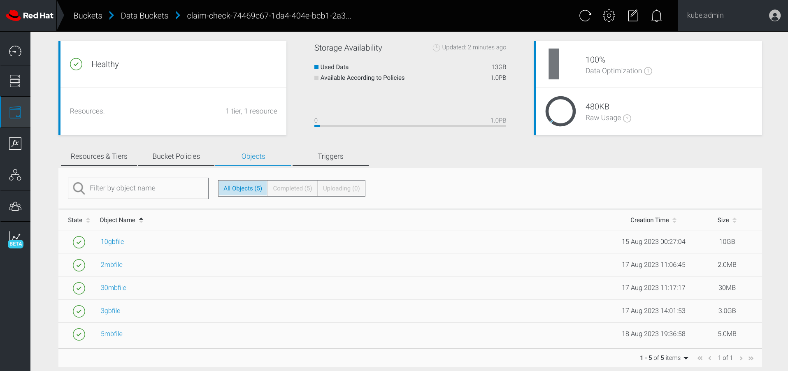

== AWS S3 Large Object Example

This example provides some tips and tricks for dealing with large objects, i.e. over 5GB, when interacting with S3 compatible storage solutions, such as https://www.noobaa.io/[NooBaa].

=== Prerequisites
- Camel 3.21.x or Camel 4.x and up
- Camel JBang
- S3 compatible storage (i.e. noobaa)

=== Install JBang

First install JBang according to https://www.jbang.dev

When JBang is installed then you should be able to run from a shell:

[source,sh]
----
$ jbang --version
----

This will output the version of JBang.

To run this example you can either install Camel on JBang via:

[source,sh]
----
$ jbang app install camel@apache/camel
----

Which allows to run CamelJBang with `camel` as shown below.

=== Setup the AWS S3 or S3 compatible bucket

This example has been tested with https://github.com/noobaa/noobaa-operator[Noobaa Operator] on OpenShift. Instructions for setting up Noobaa on OpenShift, please check published document, or https://gist.github.com/rhtevan/67fa28221eceef243aa5f46f825804bb#file-00-demo-scripts-md[this]

It is very convenient to use Noobaa for creating object bucket as well as setting up required access control.

[source,sh]
----
$ alias noobaa
alias noobaa='noobaa -n openshift-storage'
$ noobaa obc list 
NAMESPACE   NAME          BUCKET-NAME       STORAGE-CLASS                 BUCKET-CLASS                  PHASE   
demo        claim-check   claim-check-xxx   openshift-storage.noobaa.io   noobaa-default-bucket-class   Bound   
----

The following command will provide required parameters (i.e. $BUCKET_NAME, $BUCKET_ENDPOINT, $AWS_ACCESS_KEY_ID, $AWS_SECRET_ACCESS_KEY) for connecting to the S3 bucket
[source,sh]
----
$ noobaa obc status --app-namespace demo claim-check
----

=== Before run

Create working directories, dummy files and set required environment varibles

[source,sh]
----
$ mkdir inbox outbox
$ dd if=/dev/zero of=outbox/3gbfile bs=1G count=3

$ export BUCKET_NAME=xxx
$ export BUCKET_ENDPOINT=xxx
$ export AWS_ACCESS_KEY_ID=xxx
$ export AWS_SECRET_ACCESS_KEY=xxx
$ export FILE_NAME=3gbfile
----

=== How to run

Uploading object with this command:

[source,sh]
----
$ camel run --property="camel.main.streamCachingEnabled=false" uploadToS3.camel.yaml
----

Sample output

[source,sh]
----
2023-08-18 19:36:51.777  INFO 19778 --- [           main] org.apache.camel.main.MainSupport   : Apache Camel (JBang) 4.0.0 is starting
2023-08-18 19:36:51.942  INFO 19778 --- [           main] org.apache.camel.main.MainSupport   : Using Java 17.0.8 with PID 19778. Started by ezhang in /home/ezhang/app/camel-kamelets-examples/jbang/aws-s3-large-object
2023-08-18 19:36:52.428  INFO 19778 --- [           main] g.apache.camel.main.BaseMainSupport : Auto-configuration summary
2023-08-18 19:36:52.428  INFO 19778 --- [           main] g.apache.camel.main.BaseMainSupport :     [Command Line]                 camel.main.streamCachingEnabled=false
2023-08-18 19:36:53.261  INFO 19778 --- [           main] mel.cli.connector.LocalCliConnector : Camel CLI enabled (local)
2023-08-18 19:36:53.348  INFO 19778 --- [           main] e.camel.component.file.FileEndpoint : Endpoint is configured with noop=true so forcing endpoint to be idempotent as well
2023-08-18 19:36:53.348  INFO 19778 --- [           main] e.camel.component.file.FileEndpoint : Using default memory based idempotent repository with cache max size: 1000
2023-08-18 19:36:53.350  INFO 19778 --- [           main] el.impl.engine.AbstractCamelContext : Apache Camel 4.0.0 (uploadToS3) is starting
2023-08-18 19:36:54.387  INFO 19778 --- [           main] el.impl.engine.AbstractCamelContext : Routes startup (started:1)
2023-08-18 19:36:54.387  INFO 19778 --- [           main] el.impl.engine.AbstractCamelContext :     Started route1 (file://./outbox)
2023-08-18 19:36:54.387  INFO 19778 --- [           main] el.impl.engine.AbstractCamelContext : Apache Camel 4.0.0 (uploadToS3) started in 1s36ms (build:0ms init:0ms start:1s36ms)
2023-08-18 19:36:59.661  INFO 19778 --- [file://./outbox] uploadToS3.camel.yaml:20                  : Done

----

Then, download file with this command:

[source,sh]
----
$ camel run --property="camel.main.streamCachingEnabled=false" downloadFromS3.camel.yaml
----

Sample output

[source,sh]
----
$ camel run --property="camel.main.streamCachingEnabled=false" downloadFromS3.camel.yaml
2023-08-18 19:25:54.302  INFO 19224 --- [           main] org.apache.camel.main.MainSupport   : Apache Camel (JBang) 4.0.0 is starting
2023-08-18 19:25:54.494  INFO 19224 --- [           main] org.apache.camel.main.MainSupport   : Using Java 17.0.8 with PID 19224. Started by ezhang in /home/ezhang/app/camel-kamelets-examples/jbang/aws-s3-large-object
2023-08-18 19:25:55.075  INFO 19224 --- [           main] g.apache.camel.main.BaseMainSupport : Auto-configuration summary
2023-08-18 19:25:55.075  INFO 19224 --- [           main] g.apache.camel.main.BaseMainSupport :     [Command Line]                 camel.main.streamCachingEnabled=false
2023-08-18 19:25:55.811  INFO 19224 --- [           main] mel.cli.connector.LocalCliConnector : Camel CLI enabled (local)
2023-08-18 19:25:56.078  INFO 19224 --- [           main] el.impl.engine.AbstractCamelContext : Apache Camel 4.0.0 (downloadFromS3) is starting
2023-08-18 19:25:57.244  INFO 19224 --- [           main] el.impl.engine.AbstractCamelContext : Routes startup (started:1)
2023-08-18 19:25:57.245  INFO 19224 --- [           main] el.impl.engine.AbstractCamelContext :     Started route1 (aws2-s3://claim-check-74469c67-1da4-404e-bcb1-2a3015c33c3a)
2023-08-18 19:25:57.245  INFO 19224 --- [           main] el.impl.engine.AbstractCamelContext : Apache Camel 4.0.0 (downloadFromS3) started in 1s166ms (build:0ms init:0ms start:1s166ms)
2023-08-18 19:26:01.982  INFO 19224 --- [b1-2a3015c33c3a] downloadFromS3.camel.yaml:20              : Done
----

=== Check with Noobaa (aka MCG) web console
Confirm the uploaded objects

=== Tips & Tricks
- To work with Noobaa (aka MCG) S3 compatible storage, you will need Camel S3 component with a version supporting, parameter 'forcePathStyle: true'. (version 3.21.x or 4.x and up)
- To avoid OOTM error when dealing with object size larger than 2GB, must have this property, "camel.main.streamCachingEnabled=false"
- For downloading large (i.e. >2GB) object, need these two parameters: "includeBody: false, autocloseBody: true"

=== Help and contributions

If you hit any problem using Camel or have some feedback, then please
https://camel.apache.org/community/support/[let us know].

We also love contributors, so
https://camel.apache.org/community/contributing/[get involved] :-)

The Camel riders!
