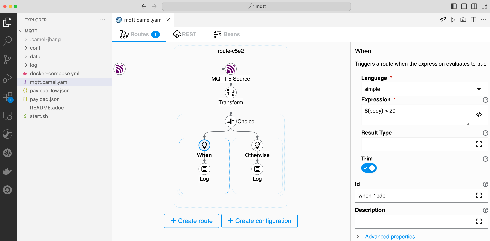

== MQTT

This example is using Camel to receive MQTT events from an external MQTT broker,
as illustrated below.

=== Install JBang

First install JBang according to https://www.jbang.dev

When JBang is installed then you should be able to run from a shell:

[source,sh]
----
$ jbang --version
----

This will output the version of JBang.

To run this example you can either install Camel on JBang via:

[source,sh]
----
$ jbang app install camel@apache/camel
----

Which allows to run CamelJBang with `camel` as shown below.

=== How to run

You need to run a MQTT broker such as via Docker, or download and run Apache ActiveMQ Artemis.

To use docker (docker compose), you can run the following command:

[source,sh]
----
$ start.sh
----

Or use

[source,sh]
----
$ docker-compose up
----

Then you can run the Camel integration using:

[source,sh]
----
$ camel run mqtt.camel.yaml
----

And then from another terminal (or run the integraiton with `--background` option),
then send a message to the MQTT broker. This can be done with the help from camel-jbang
where you can send a message as follows:

[source,sh]
----
$ camel cmd send --body=file:payload.json mqtt
----

This will send a message where the payload (body) is read from the local file named payload.json.
The message is sent to an existing running Camel integration (named mqtt). Then Camel will
then send the message to the MQTT broker. So in other words we use Camel as a proxy to send the
message to the actual MQTT broker.

The Camel integration will then consume the payload and output in the console.

[source,text]
----
2023-04-14 08:58:58.676  INFO 62348 --- [calCliConnector] mqtt.camel.yaml:27                  : Warm temperature at 21
----

==== Stopping

To stop Docker, you can run

[source,sh]
----
$ docker-compose down
----

And you can stop Camel with

[source,sh]
----
$ camel stop mqtt
----

=== Help and contributions

If you hit any problem using Camel or have some feedback, then please
https://camel.apache.org/community/support/[let us know].

We also love contributors, so
https://camel.apache.org/community/contributing/[get involved] :-)

The Camel riders!
